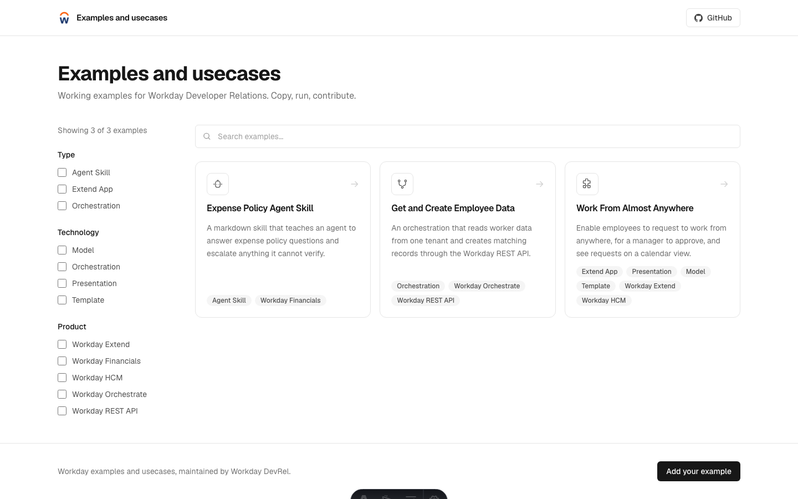
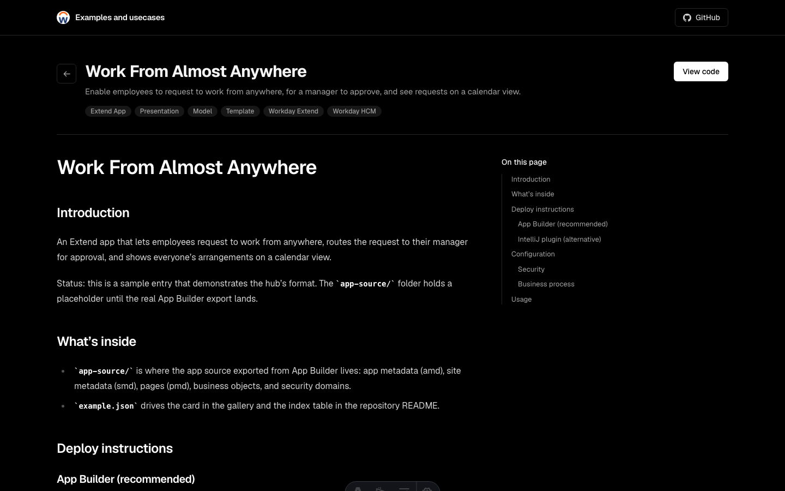

<div align="center">


# Workday Examples Hub

**A single, open home for Workday Build examples.**

Browse working examples, copy them into your own projects, and contribute your own.

[](CONTRIBUTING.md)
[](#browse-visually-optional)
[](#community-and-support)

[**Browse the gallery**](#browse-visually-optional) · [Use an example](#use-an-example) · [Contribute](#contributing)

</div>

---

## What is this?

Workday Build examples used to live in many places: the App Catalog, the docs, the forum. This repository brings them into one place that you can browse, copy from, and add to.

Every example:

- lives in its own folder under [`catalog/`](catalog) (Workday-built apps) or [`examples/`](examples) (community examples, open to everyone) with everything it needs: Extend app source, orchestration definitions, agent skills written as markdown, diagrams, whatever the artifact is.
- ships with two small files: `example.json` (metadata that drives the index below and the optional gallery) and a README that says what it is and how to use it.
- demonstrates a real Workday capability. Types, components, and products come from the approved lists in [`hub.config.json`](hub.config.json), and CI enforces them.

## Repository layout

```
catalog/                 Workday-built apps, maintained by Workday
examples/                Community examples, open to external contributions
  _template/             Copy this (or run the scaffolder) to start a new example
scripts/
  new-example.mjs        Scaffold a new example folder in one command
  new-example.sh / .ps1  The same scaffolder for machines without Node
  validate-examples.mjs  CI validation + README index generation
site/                    Optional Astro gallery (not required to use the examples)
hub.config.json          Repo URLs and the approved type, component, and product lists
```

## Example types

- 🧩 **Extend App**: full app source, ready to deploy to your development tenant with whatever tooling you build with.
- 🔌 **Integration App**: orchestration-driven integrations connecting Workday to other systems.
- ⚙️ **Orchestration**: focused orchestration definitions for Orchestration Builder.
- 🤖 **Agent Skill**: agent skills and instructions, written as markdown.
- 📄 **Reference**: design patterns, diagrams, and other material worth copying.

## Use an example

```bash
git clone https://github.com/Workday/Developer-Relations
cd Developer-Relations
```

Open the folder you want under `catalog/` or `examples/` and follow its README. What "use it" means depends on the type:

- **Extend app source**: deploy to your WCP development tenant with your usual tooling (App Builder, the (VScode, Cursor, Claude code) plugins, or the WDCLI), then install and launch.
- **Orchestrations and integration apps**: import into Orchestration Builder, promote if your tenant needs it, and deploy to your tenant.
- **Agent skills and reference material**: read, copy, adapt.

## App catalog

Workday-built apps, maintained by Workday. Both tables below are kept in sync with each entry's `example.json` by `scripts/validate-examples.mjs`.

<!-- catalog:start -->
| Example | Description | Type |
| --- | --- | --- |
| [`work-from-anywhere-extend-app`](catalog/work-from-anywhere-extend-app) | Enable employees to request to work from anywhere, for a manager to approve, and see requests on a calendar view. | Extend App |
<!-- catalog:end -->

## Examples

Community examples, open to everyone. This is the section external contributions land in.

<!-- examples:start -->
| Example | Description | Type |
| --- | --- | --- |
| [`expense-policy-agent-skill`](examples/expense-policy-agent-skill) | A markdown skill that teaches an agent to answer expense policy questions and escalate anything it cannot verify. | Agent Skill |
| [`employee-data-orchestration`](examples/employee-data-orchestration) | An orchestration that reads worker data from one tenant and creates matching records through the Workday REST API. | Orchestration |
<!-- examples:end -->

## Contributing

We want your examples. Community contributions go into `examples/` (the Examples section); the catalog is Workday-maintained, so if you think something belongs there, open an issue instead. Adding an example doesn't take much:

1. Scaffold a folder: `node scripts/new-example.mjs your-example-name`. No Node? `./scripts/new-example.sh` (macOS, Linux) and `scripts\new-example.ps1` (Windows) do the same thing.
2. Drop your artifact in, and fill in the generated `example.json` and README.
3. Validate: `node scripts/validate-examples.mjs`
4. Open a pull request. Workday DevRel reviews every submission before merge.

Prefer to do it by hand? No tooling is required. Copy [`examples/_template`](examples/_template) into a new folder (you can even create the files straight from the GitHub web UI), fill in the two files, and open the PR. The index table above can be edited by hand, or a reviewer will regenerate it for you during review.

The full guide is in [CONTRIBUTING.md](CONTRIBUTING.md).

## Browse visually (optional)

The [`site/`](site) folder holds a gallery that renders every example as a card with search and type filters, and every example gets its own page built from its README. Nothing in the repo depends on it; the examples are fully usable without it.





To run it locally:

```bash
cd site && npm install && npm run dev
```

There is no hosted version while this repository is private. Once it is public, enable GitHub Pages (source: GitHub Actions) and the deploy workflow takes it from there, redeploying automatically whenever examples change.

## Community and support

- **Questions and ideas**: open a [discussion](https://github.com/Workday/Developer-Relations/discussions) or start a thread on the Workday community forum.
- **Bugs in an example**: open an [issue](https://github.com/Workday/Developer-Relations/issues) using the bug report template.
- **New example proposals**: open an issue with the proposal template before you build, if you want early feedback.

## Use at your own pace, verify everything

Everything in this repository is provided as is, without warranty of any kind. Examples are starting points, not production software. Review the code, adapt it to your configuration, and always test in a non-production tenant before deploying anything to a tenant you care about. Submissions are reviewed before merge, but review does not replace your own verification.

## License

Copyright 2026 Workday. Licensed under the Apache License, Version 2.0.
